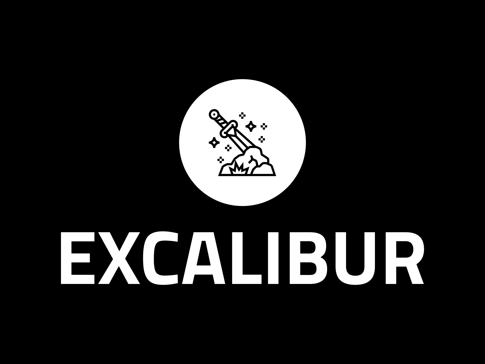

# Excalibur
Excalibur is a highly deceptive software posing a severe risk to computer systems. Masquerading as an innocent-looking game, it cleverly gains access through an installer that demands administrative privileges for execution, just like legitimate installers. While the installation process appears ordinary, unbeknownst to the user, Excalibur secretly initiates a malicious operation in the background.

Operating behind the facade of harmless installation, Excalibur deploys a sinister tactic aimed at the computer's Master Boot Record (`MBR`). The `MBR` is a crucial component responsible for booting the operating system, and Excalibur targets it with destructive intent. Through a series of covert actions, Excalibur overwrites the `MBR`, irreversibly tampering with its critical data structures. The consequences of this covert attack are severe, rendering the operating system completely inoperable, and leaving the computer unusable.

What makes Excalibur particularly insidious is its ability to execute this damaging process silently, catching users unaware of the impending catastrophe until it's too late. If the installer overwrites the Master Boot Record (`MBR`), there may be a potential for developing a custom solution that allows users to create and write their own `MBR`. This enhanced functionality could provide users with greater control over their system's boot process, enabling them to load alternative operating systems or customized configurations.

The project is divided into several modules, each serving specific purposes:

- Excalibur: The deceptive game acting as a decoy.
- Excalibur-Installer: The main exploit responsible for installing the Excalibur module and other exploits, including the `MBR` overwrite.
- Excalibur-KeyLogger: A keylogger that reports back at every shutdown and launches at startup, sending data to a predefined IP address located in `config.h`.
- Excalibur-HookAPI: A Task Manager `DLL` hook that makes the Keylogger invisible in the Task Manager. Note that this module is not yet implemented.

## OpenGL Support for Legacy and Virtual Machines
To enable older machines and virtual machines without a modern OpenGL version, you can copy the `opengl32.dll` file from the`Vendor/` folder and paste it into the installation directory (usually located at `C:\Program Files\Excalibur`). By doing so, you ensure that the required `opengl32.dll` file is present in the installation directory, enabling the application to function correctly on these machines. In a future update, the `dll` will be automatically installed.

_**NOTE**: The `opengl32.dll` is provided by Mesa3D_ 

## Disclaimer

This code is shared strictly for educational purposes only. It was developed to demonstrate potential security vulnerabilities and should not be used for any malicious or harmful activities.

By accessing and using this code, you acknowledge that:

1. The code is provided "as is," and the author(s) make no warranties or guarantees regarding its functionality, security, or fitness for any purpose.
2. The code may contain vulnerabilities or errors that could lead to unintended consequences or harm to computer systems or networks.
3. You will not use this code for any unauthorized or malicious activities, including but not limited to spreading malware, gaining unauthorized access, or causing disruption to computer systems or networks.
4. The author(s) of this code will not be held liable for any damages or losses resulting from the use or misuse of this code.

Please use this code responsibly and only for educational purposes. If you discover any vulnerabilities or improvements, kindly report them to the author(s) to help enhance its educational value.

By using this code, you agree to these terms and conditions.

## Note
The repository is still a work in progress, with the game and `Excalibur-HookAPI` yet to be fully developed._ My development progress fluctuates significantly due to the simultaneous management of multiple ongoing projects, spanning both computer science-related and unrelated domains.
